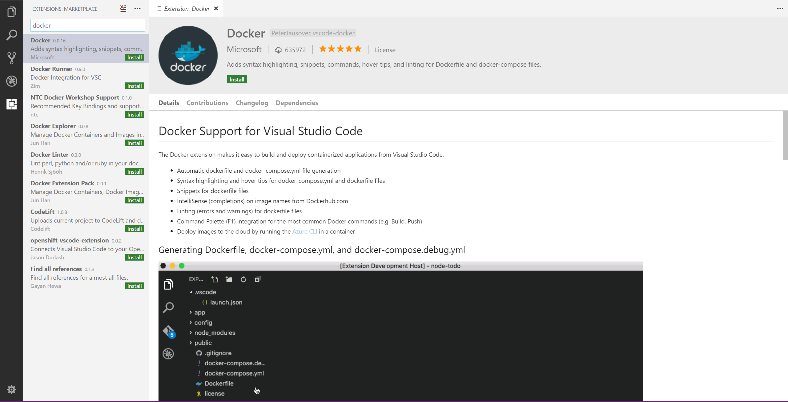
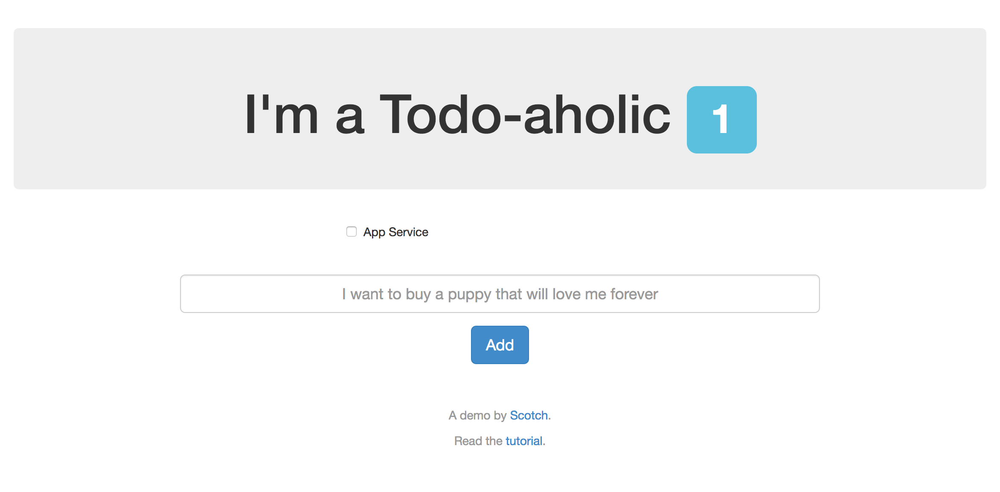
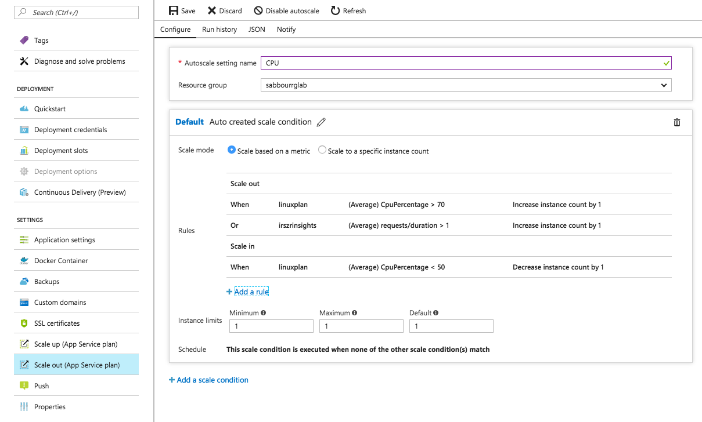

# Containers on Azure App Service


## Table of Contents

   * [Containers on Azure App Service](#containers-on-azure-app-service)
      * [Table of Contents](#table-of-contents)
      * [Overview and Pre-Requisites](#overview-and-pre-requisites)
         * [Overview](#overview)
         * [Pre-requisites](#pre-requisites)
         * [Topics Covered](#topics-covered)
      * [Lab](#lab)
         * [Running locally](#running-locally)
         * [Pushing Docker images to Azure Container Registry](#pushing-docker-images-to-azure-container-registry)
         * [Deployment to Azure App Service](#deployment-to-azure-app-service)
         * [Creating CosmosDB database with MongoDB adapter and configuring the Web App](#creating-cosmosdb-database-with-mongodb-adapter-and-configuring-the-web-app)
      * [Conclusion](#conclusion)
      * [End your Lab](#end-your-lab)
      * [Additional Resources and References](#additional-resources-and-references)
      * [License](#license)


## Overview and Pre-Requisites

### Overview

In this lab, you're going to take a MEAN app (MongoDB, Express.js, AngularJS and Node.js) that is "Dockerized" with a Dockerfile and deploy it to Azure App Service (Linux). The Docker image you create will be pushed to an instance of Azure Container Service.

> The application being deployed is a Dockerized version of [node-todo](https://github.com/scotch-io/node-todo) by [@scotch-io](https://github.com/scotch-io)

### Pre-requisites

- Docker installed on your machine
    
    On Windows, install Docker for Windows: https://docs.docker.com/docker-for-windows/install/#install-docker-for-windows 
    
    On a Mac, install Docker for Mac: https://docs.docker.com/docker-for-mac/install/#install-and-run-docker-for-mac 
    
    Then, verify installation:
    ```
    docker -v
    ```
- Visual Studio Code (or your favorite code editor)
    
    On Windows and Mac, download and install from: https://code.visualstudio.com/Download
    
    Then, verify installation:
    ```
    code --version
    ```

    Install Docker extension for VS Code (optional)
    

- Azure CLI installed and configured with your Azure subscription
    
    On Windows, download and install from: https://aka.ms/InstallAzureCliWindows 
    On a Mac, run the below command in Terminal
    ```
    curl -L https://aka.ms/InstallAzureCli | bash
    ```

    Then login into your Azure subscription to verify installation:
    ```
    az login
    ```

    If you have many subscriptions, you may choose one:
    ```
    az account set -s <subscription-GUID>
    ```

    Create the Resource Group to use throughout the lab:
    ```
    az group create -n <rg name> -l westeurope 
    ```

    Set the default Resource Group for your session, to avoid typing it in all commands
    ```
    az configure --defaults group=<rg name>
    ```

### Topics Covered

- Running locally
- Pushing Docker images to Azure Container Registry
- Deployment to Azure App Service
- Creating CosmosDB database with MongoDB adapter and configuring the Web App

## Lab

### Running locally

Clone the current repository to your machine

Change directory to ```ApplicationModernization/ContainersOnAzureAppService```

Open the ```src/Dockerfile``` in your code editor, and review it

Build the image, tagging it as **meantodo**
```
docker build -t meantodo src/.
```

Run the image locally
```
docker run –p 8080:8080 meantodo
```

Browse to http://localhost:8080/

### Pushing Docker images to Azure Container Registry

Create an Azure Container Registry (~2 minutes)
```
az acr create -n <registry name> --admin-enabled --sku Managed_Standard
```

<!---
Create a new service principal and assign access:
```
az ad sp create-for-rbac --scopes /subscriptions/90ab3701-83f0-4ba1-a90a-f2e68683adab/resourceGroups/sabbourrglab/providers/Microsoft.ContainerRegistry/registries/sabbouracr --role Owner --password <password>
```
-->

Login into the registry. This will enable your local Docker installation to be able to access the registry.
```
az acr login -n <registry name>
```

Change your image tag to point to the registry
```
docker tag <image>:latest <registry name>.azurecr.io/<image>:latest
```

Publish your image to the registry
```
docker push <registry name>.azurecr.io/<image>:latest
```

### Deployment to Azure App Service

Create the App Service Plan
```
az appservice plan create -n <plan name> --is-linux
```

Create the Web App
```
az webapp create -n <web app name> -p <plan name> -i <registry name>.azurecr.io/<image>:latest
```

Get the Azure Container Registry credentials
```
az acr credential show -n <registry name>
```

Update the Web App configuration with Azure Container Registry credentials and container image
```
az webapp config container set -n <web app name> -g <rg name>
-i <registry name>.azurecr.io/<image>:latest
-r https://<registry name>.azurecr.io
-u <acr admin username>
-p <acr admin password>
```

Enable Docker Container Logging for STDOUT and STDERR output from the container
```
az webapp log config -n <web app name> --web-server-logging filesystem
```

Browse to the Web App [http://webappname.azurewebsites.net](http://webappname.azurewebsites.net). It may take a short while for the first load as the Docker image is being pulled.

> Notice that you'll find the Web App is not working, since we need to create the MongoDB. You can view your Web App's STDERR and STDOUT output from the container on the streaming logs here: 
https://webappname.scm.azurewebsites.net/api/logstream

> Notice that if you update the image in the Azure Container Registry, you will need to Stop/Start or Restart the Web App to pull the new Docker image. This is something that will be addressed at a later lab where you will enable Continuous Integration and Continuous Deployment. 

### Creating CosmosDB database with MongoDB adapter and configuring the Web App

In your terminal, type the following command to create the MongoDB database (~5 minutes)
```
az cosmosdb create -n <mongo name> --kind MongoDB
```

Get the MongoDB connection string
```
az cosmosdb list-connection-strings -n <mongo name>
```


Configure the ```MONGO_URL``` environment variable on the Web App. This is how the application is configured to read the connection string through ```process.env.MONGO_URL```.
```
az webapp config appsettings set -n <web app name> --settings MONGO_URL="<the connection string>"
```

Now browse to the web app again and play around with inserting a few items, it should be working.




### Scaling
Manually scale the App Service Plan hosting the Web App to 2 workers
```
az appservice plan update --number-of-workers 2 -n <plan name>
```
You can also setup auto-scaling by different metrics, such as CPU usage, memory usage or even metrics from Application Insights through the Azure portal, but you need to be running the Standard or Premium SKUs.



## Conclusion

In this lab, you created a private Docker image repository on Azure Container Registry and pushed an MEAN application image to it. You also created an App Service Plan running Linux and a Web App that is configured to pull that Docker image. For the database, you created a MongoDB on top of CosmosDB.


## End your Lab

Clean up your lab by deleting the Resource Group you created.
```
az group delete -n <rg name>
```

## Additional Resources and References

- [Azure Container Registry](https://docs.microsoft.com/en-us/azure/container-registry/)
- [Azure App Service Linux](https://docs.microsoft.com/en-us/azure/app-service/app-service-linux-readme)
- [Azure Cosmos DB](https://docs.microsoft.com/en-us/azure/cosmos-db/)


## License

Copyright (c) Microsoft Corporation. All rights reserved.

Licensed under the [MIT](LICENSE) License.