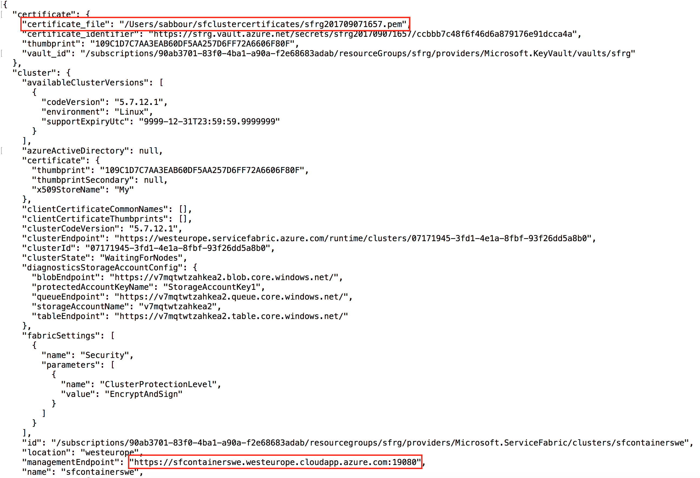
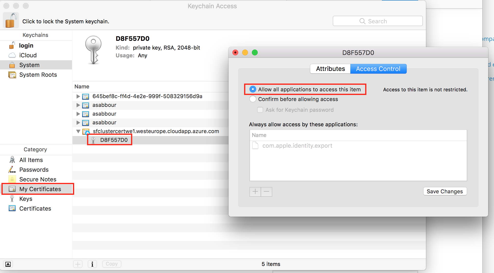
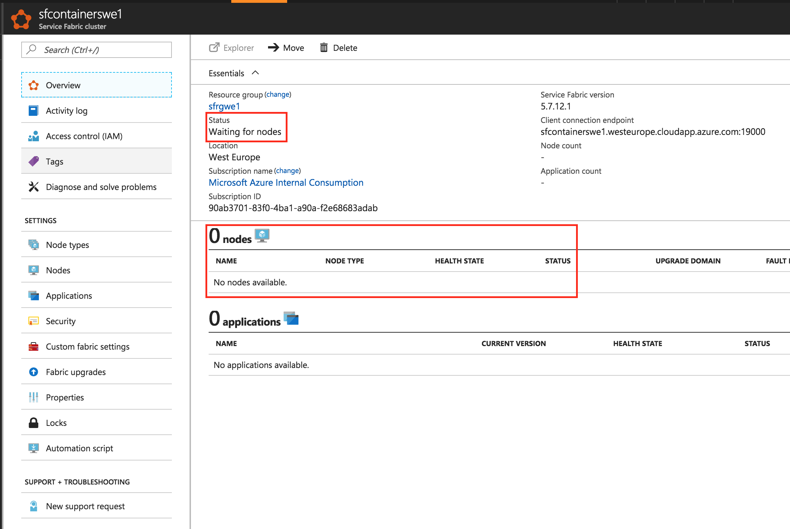

# Containers on Azure Service Fabric


## Table of Contents

   * [Containers on Azure Service Fabric](#containers-on-azure-service-fabric)
      * [Table of Contents](#table-of-contents)
      * [Overview and Pre-Requisites](#overview-and-pre-requisites)
         * [Overview](#overview)
         * [Pre-requisites](#pre-requisites)
         * [Topics Covered](#topics-covered)
      * [Lab](#lab)
         * [Running locally](#running-locally)
         * [Pushing Docker images to Azure Container Registry](#pushing-docker-images-to-azure-container-registry)
         * [Creating CosmosDB database with MongoDB adapter](#creating-cosmosdb-database-with-mongodb-adapter)
         * [Creating Azure Service Fabric on Linux (~ 15 minutes)](#creating-azure-service-fabric-on-linux--15-minutes)
         * [Deploying the container to the Azure Service Fabric cluster](#deploying-the-container-to-the-azure-service-fabric-cluster)
      * [Conclusion](#conclusion)
      * [End your Lab](#end-your-lab)
      * [Additional Resources and References](#additional-resources-and-references)
      * [License](#license)

## Overview and Pre-Requisites

### Overview

In this lab, you're going to take a MEAN app (MongoDB, Express.js, AngularJS and Node.js) that is "Dockerized" with a Dockerfile and deploy it to Azure Service Fabric on Linux. The Docker image you create will be pushed to an instance of Azure Container Registry.

> Note that Azure Service Fabric on Linux is in Preview.

> The application being deployed is a Dockerized version of [node-todo](https://github.com/scotch-io/node-todo) by [@scotch-io](https://github.com/scotch-io)

### Pre-requisites

- Docker installed on your machine
    
    On Windows, install Docker for Windows: https://docs.docker.com/docker-for-windows/install/#install-docker-for-windows 
    
    On a Mac, install Docker for Mac: https://docs.docker.com/docker-for-mac/install/#install-and-run-docker-for-mac 
    
    Then, verify installation:
    ```
    docker -v
    ```
- Visual Studio Code (or your favorite code editor)
    
    On Windows and Mac, download and install from: https://code.visualstudio.com/Download
    
    Then, verify installation:
    ```
    code --version
    ```

    Install Docker extension for VS Code (optional)
    

- Azure CLI installed and configured with your Azure subscription
    
    On Windows, download and install from: https://aka.ms/InstallAzureCliWindows 
    On a Mac, run the below command in Terminal
    ```
    curl -L https://aka.ms/InstallAzureCli | bash
    ```

    Then login into your Azure subscription to verify installation:
    ```
    az login
    ```

    If you have many subscriptions, you may choose one:
    ```
    az account set -s <subscription-GUID>
    ```

    Create the Resource Group to use throughout the lab:
    ```
    az group create -n <rg name> -l uksouth 
    ```

    Set the default Resource Group for your session, to avoid typing it in all commands
    ```
    az configure --defaults group=<rg name>
    ```
- Service Fabric CLI installed on your machine

    Follow the [instructions](https://docs.microsoft.com/en-us/azure/service-fabric/service-fabric-cli) for your operating system.

### Topics Covered

- Running locally
- Pushing Docker images to Azure Container Registry
- Creating CosmosDB database with MongoDB adapter
- Creating Azure Service Fabric on Linux
- Deploying the container to the Azure Service Fabric cluster


## Lab


### Running locally

Clone the current repository to your machine

Change directory to ```ApplicationModernization/ContainersOnServiceFabric```

Open the ```src/Dockerfile``` in your code editor, and review it

Build the image, tagging it as **meantodo**
```
docker build -t meantodo src/.
```

Run the image locally
```
docker run –p 8080:8080 meantodo
```

Browse to http://localhost:8080/

### Pushing Docker images to Azure Container Registry

Create an Azure Container Registry (~2 minutes)
```
az acr create -n <registry name> --admin-enabled --sku Managed_Standard
```

<!---
Create a new service principal and assign access:
```
az ad sp create-for-rbac --scopes /subscriptions/90ab3701-83f0-4ba1-a90a-f2e68683adab/resourceGroups/sabbourrglab/providers/Microsoft.ContainerRegistry/registries/sabbouracr --role Owner --password <password>
```
-->

Login into the registry. This will enable your local Docker installation to be able to access the registry.
```
az acr login -n <registry name>
```

Change your image tag to point to the registry
```
docker tag <image>:latest <registry name>.azurecr.io/<image>:latest
```

Publish your image to the registry
```
docker push <registry name>.azurecr.io/<image>:latest
```

### Creating CosmosDB database with MongoDB adapter

In your terminal, type the following command to create the MongoDB database (~5 minutes)
```
az cosmosdb create -n <mongo name> --kind MongoDB
```


### Creating Azure Service Fabric on Linux (~ 15 minutes)

You need to pass the location of your Resource Group. This creates a cluster that is secured by an X.509 certificate. The certificate subject name must match the domain name used to access the Service Fabric Cluster.
```
mkdir ~/sfclustercertificates

az sf cluster create
-n <cluster name>
--os UbuntuServer1604
--vm-user-name <admin username>
--vm-password <admin password>
--certificate-subject-name <cluster name>.<region>.cloudapp.azure.com
--certificate-password <password to secure certificate>
--certificate-output-folder ~/sfclustercertificates
-l <your resource group location>
```

Make note of the PEM certificate path and management endpoint. You'll use them to connect to the cluster.


Export the certificate as a PFX
```
openssl pkcs12 -export -in <path to your pem file> -out ~/sfclustercertificates/sf.pfx
```

Install the certificate on your machine.
```
open ~/sfclustercertificates/sf.pfx
```

On Mac OSX, enable applications to access that key by launching Keychain, browsing to **My Certificates**, expanding the certificate and double clicking the private key. Once open, switch to **Access Control** and make sure **Allow all applications to access this item** is checked.


The Azure Portal should now say that the cluster status is **waiting for nodes**. Once you see the nodes are ready, you may proceed to the next step.



Connect to the cluster
```
sfctl cluster select --endpoint <management endpoint> --pem <path to your pem file> --no-verify
```

Verify you are indeed connected by checking the cluster health
```
sfctl cluster health
````

You should also be able to use the browser to browse to the management endpoint. You'll be able to pick your certificate to use for authentication.


Then once you're in, you should see your cluster status.


### Deploying the container to the Azure Service Fabric cluster

Get the MongoDB connection string
```
az cosmosdb list-connection-strings -n <mongo name>
```
> Make note of this connection string as you'll need to paste it in the application configuration later on.

Get the Azure Container Registry username and password
```
az acr credential show -n <acr name>
```

Examine the ```src/docker-compose.yaml``` file which should be like the below, replace ```<acr name>``` with your Azure Container Registry name and ```<mongo connection string>``` with the connection string you obtained from the earlier steps.

```YAML
version: '3'

services:
  web:
    image: <acr name>.azurecr.io/meantodo
    ports:
      - 80:8080
    environment:
      - MONGO_URL=<mongo connection string>
```

Deploy to Azure Service Fabric using the **docker-compose.yml** file using the following command, passing in your Azure Container Registry credentials. You'll be prompted to provide the password.
```
sfctl compose create
--application-id fabric:/meantodo
--compose-file src/docker-compose.yml
--repo-user <acr username>
```

Almost immediately, you should see the Service Fabric application show up in the Service Fabric Explorer and see that it has been deployed on 3 nodes, as specified in the ```docker-compose.yml``` file.


Browse to the cluster domain from the earlier steps [http://<cluster name\>.<region\>.cloudapp.azure.com](http://.cloudapp.azure.com)

You should see the app running.


## Conclusion

In this lab, you created a private Docker image repository on Azure Container Registry and pushed an MEAN application image to it. You also created an Azure Service Fabric cluster running Linux and deployed the Docker application (using Docker Compose). For the database, you created a MongoDB on top of CosmosDB.


## End your Lab

Clean up your lab by deleting the Resource Group you created.
```
az group delete -n <rg name>
```

## Additional Resources and References

- [Azure Container Registry](https://docs.microsoft.com/en-us/azure/container-registry/)
- [Azure Service Fabric](https://docs.microsoft.com/en-us/azure/service-fabric/)
- [Azure Service Fabric on Linux](https://docs.microsoft.com/en-us/azure/service-fabric/service-fabric-linux-overview)
- [Azure Service Fabric with Containers](https://docs.microsoft.com/en-us/azure/service-fabric/service-fabric-containers-overview)
- [Azure Cosmos DB](https://docs.microsoft.com/en-us/azure/cosmos-db/)


## License

Copyright (c) Microsoft Corporation. All rights reserved.

Licensed under the [MIT](LICENSE) License.